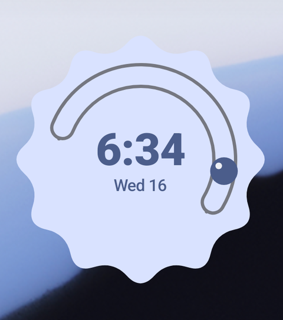
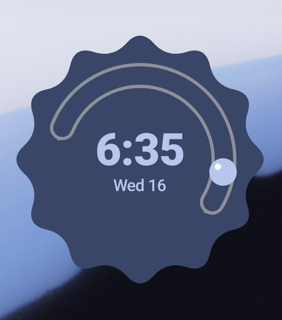
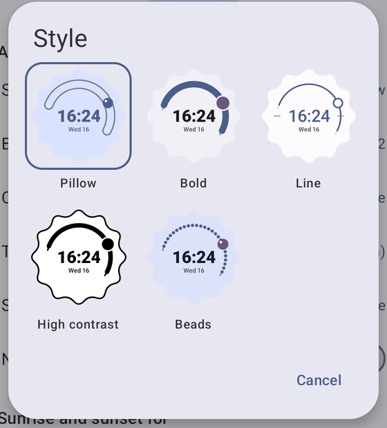
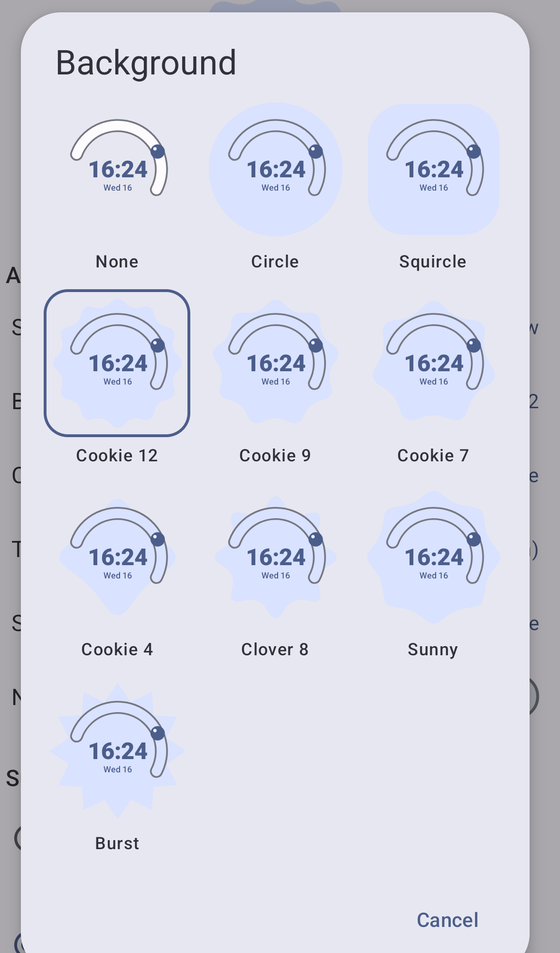
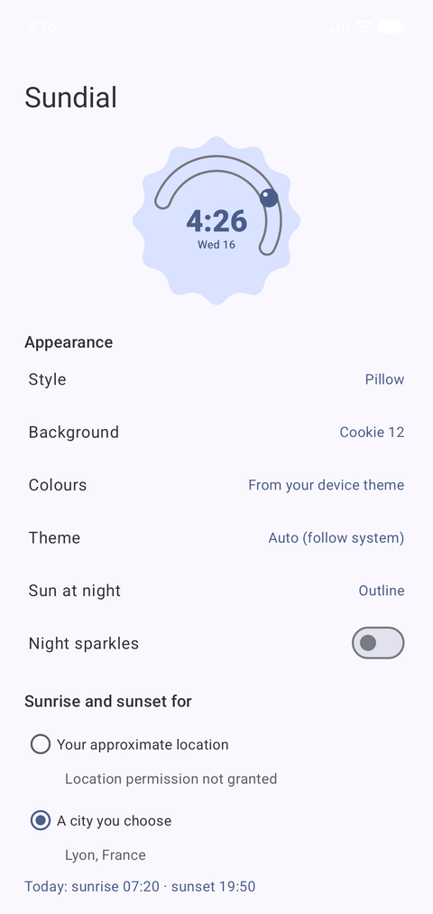

# Sundial

A minimalist sun-path clock widget for Android, styled with Material You.

Instead of hands, a 24-hour dial shows today's sun: an arc from sunrise to sunset, a thin line through twilight, and nothing at night. A small sun moves along it through the day. The colours come from your wallpaper.

<p align="center">
  
  
</p>

## What it does

- **24-hour dial** — midnight at the bottom, noon at the top. The daylight track runs from today's real sunrise to sunset, the thin line extends through civil twilight, the night stays blank.
- **Real sun times** — computed on-device with the NOAA solar algorithm from your approximate location (or a city you choose). No network, no accounts.
- **Material You** — reads the system's dynamic colour palette, follows light/dark, and rounds to the launcher's corner radius. Or pick a fixed hue preset.
- **Your style** — five looks (Pillow, Bold, Line, High contrast, Beads), ten background shapes (Material You cookies, clover, sunny, burst, circle, squircle, or none), sun-at-night as outline / moon / hidden, optional night sparkles.
- **Tap to open** the clock app, any app you choose, or nothing.
- **Battery-friendly** — the digital time is a `TextClock` that ticks by itself; the sun only needs a re-render every 15 minutes, done with an inexact, non-wakeup alarm.

<p align="center">
  
  
  
</p>

## Requirements

- Android 12 or newer (`minSdk 31`, needed for dynamic colour).
- To build: Android Studio 2026.1 or newer (the project uses AGP 9.2 with its built-in Kotlin support) and the Android 17 (API 37) platform.

## Building

```bash
./gradlew :app:assembleDebug
./gradlew :app:testDebugUnitTest
```

Gradle needs a JDK 17+; from a terminal without one, point it at Android Studio's:

```bash
export JAVA_HOME="/Applications/Android Studio.app/Contents/jbr/Contents/Home"
```

For a signed release build, copy `keystore.properties.example` to `keystore.properties`, fill in your keystore, then `./gradlew :app:assembleRelease`. The keystore and properties file are gitignored.

## How it works

Widgets can't host arbitrary drawing, so the face is rendered to a bitmap and shown in an `ImageView` inside the widget's `RemoteViews`:

```
AlarmManager (every 15 min, inexact, non-wakeup)
  └─ SundialWidgetProvider ─▶ SundialWidgetUpdater
        ├─ DayProgress.now()            time of day → 0..1
        ├─ SunTimesProvider.today()     location → NOAA → daylight / twilight spans
        ├─ AppearanceSettings           look, shape, colours, theme
        └─ SundialRenderer.render(...)  pure Canvas → Bitmap, one per widget size
```

| Piece | Where |
|---|---|
| Drawing (no Android component dependencies, testable on its own) | `render/SundialRenderer.kt`, `render/Shapes.kt`, `render/SundialColors.kt` |
| Sunrise / sunset / civil twilight (NOAA), polar day and night handled | `sun/SunCalculator.kt` |
| Location: approximate permission with a city-list fallback | `location/` |
| Widget plumbing: provider, updater, alarm, boot / time-change receiver | `widget/` |
| Settings and the widget's reconfigure screen | `MainActivity.kt`, `settings/` |

Notes worth knowing:

- Android hands no location to a widget running in the background without the "all the time" permission, so the fix is refreshed whenever the settings screen is open and reused in between — city-level accuracy is all sunrise times need.
- Inexact alarms are batched by the system within 75 % of their interval, so a tick can land up to ~11 minutes late. That is invisible on a 24-hour dial; the digital time is unaffected.
- The update interval is a single constant, `SundialUpdateScheduler.UPDATE_INTERVAL_MS`.

## Status

Early (0.1). Works, but the visual design is still being tuned.
